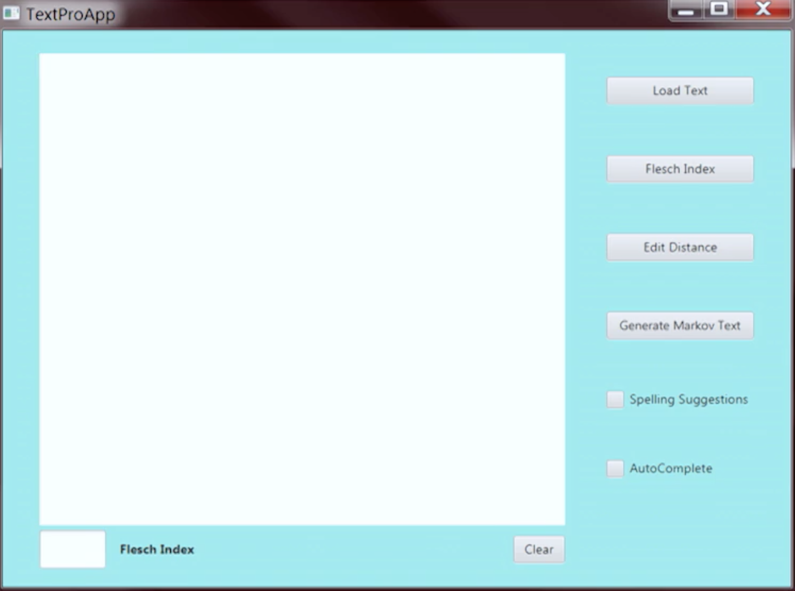
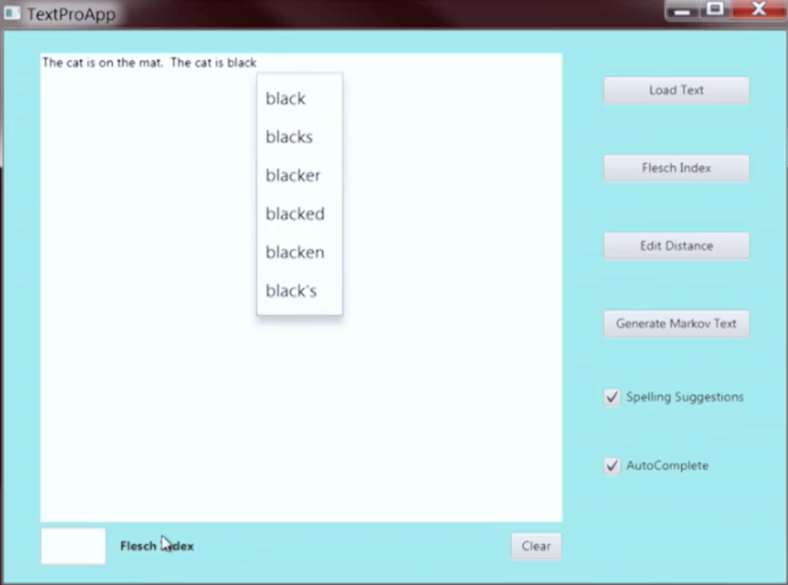
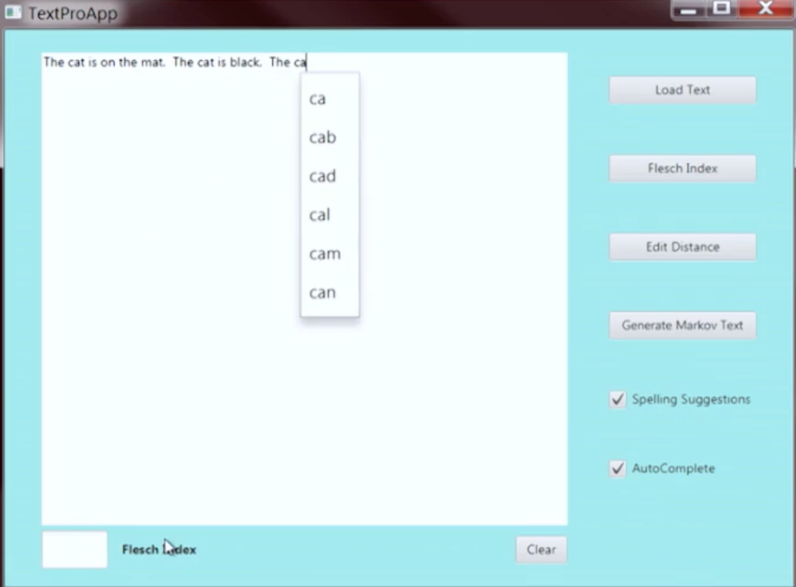
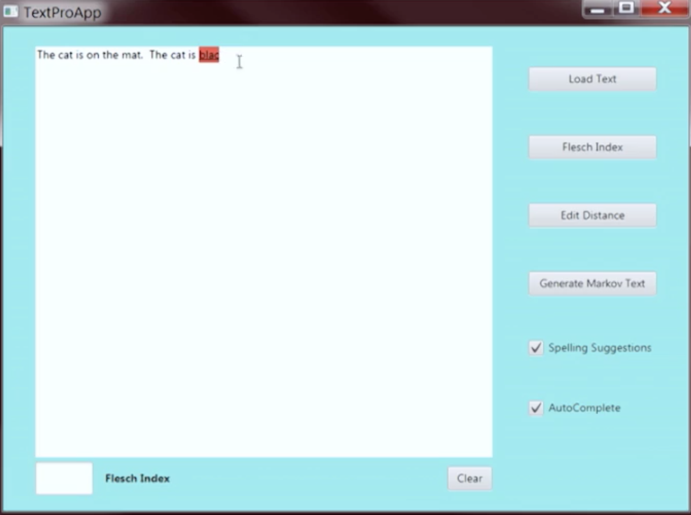
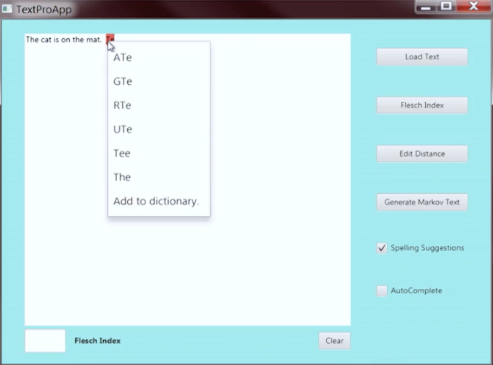

# UCSD_TextEditor
GUI of the project:

This repo is for a text editor design, to implement "misspelling" and "autocomplete" functions.

## FEATURE I : Autocomplete
When the user types part of the word, suggestions will be given for the user to choose, it is user's preference to type completely or choose one of the words below.

## FEATURE II : Misspelling

When the user stops typing, the text editor will check automatically whether the word is typed correctly or misspelled, the misspelled word will be marked in red and some suggestions will be given to the user.

